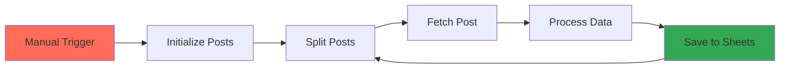

# Posts Processing Workflow

> An automated n8n workflow for fetching, processing, and storing blog posts with advanced error handling and data quality management.

[](https://n8n.io)
[](https://jsonplaceholder.typicode.com)
[](https://sheets.google.com)

## 🚀 Overview

This n8n workflow automatically processes blog posts from the JSONPlaceholder API, performing data transformation, quality validation, and storing results in Google Sheets. Built with robust error handling and comprehensive data processing capabilities.

## 📋 Features

- **Automated Data Pipeline**: ETL process for blog posts
- **Advanced Error Handling**: Multi-level retry logic and graceful failures
- **Data Quality Management**: Comprehensive validation and default values
- **Text Processing**: Title case conversion, keyword extraction, content analysis
- **Batch Processing**: Memory-efficient sequential processing
- **Audit Trail**: Complete processing history and metadata tracking
- **Structured Data Output**: Organized content, metadata, and analytics sections

## 🏗️ Architecture



## 📊 Workflow Components

### 1. **Manual Trigger**
- **Type**: `n8n-nodes-base.manualTrigger`
- **Purpose**: Workflow initiation point

### 2. **Initialize Posts**
- **Type**: `n8n-nodes-base.code`
- **Function**: Generate post IDs (1-10)
- **Output**: Array of `{post_id: number}` objects

### 3. **Split Posts**
- **Type**: `n8n-nodes-base.splitInBatches`
- **Function**: Process posts individually
- **Pattern**: Producer-Consumer with loop control

### 4. **Fetch Post**
- **Type**: `n8n-nodes-base.httpRequest`
- **API**: `https://jsonplaceholder.typicode.com/posts/{id}`
- **Error Handling**: 2 retry attempts, continue on failure
- **Response Format**:
```json
{
  "userId": 1,
  "id": 1,
  "title": "Post title",
  "body": "Post content..."
}
```

### 5. **Process Data**
- **Type**: `n8n-nodes-base.code`
- **Function**: Advanced data transformation and validation

#### Data Processing Features:
- **Default Value Management**: Handles missing/null fields
- **Text Normalization**: Title case conversion and cleanup
- **Content Analysis**: Word count, keyword extraction, common words
- **Categorization**: Content-based classification (short/medium/long)
- **Metadata Generation**: Processing steps, timestamps, quality flags
- **Structured Output**: Organized into content, metadata, and analytics sections

#### Output Schema:
```javascript
{
  "record_id": "POST_010",                    // Unique identifier
  "content": {
    "title": "Optio Molestias Id Quia Eum",   // Cleaned and formatted title
    "body": "quo et expedita modi cum...",    // Truncated content
    "word_count": 18,                         // Content word count
    "category": "short",                      // Auto-categorization
    "keywords": [                             // Extracted keywords array
      "optio",
      "molestias", 
      "id"
    ]
  },
  "metadata": {
    "original_id": 10,                        // Source post ID
    "user_id": 1,                            // Author ID
    "processed_date": "2025-06-08",          // Processing timestamp
    "status": "processed",                    // Processing status
    "tags": [                                // Auto-generated tags array
      "processed",
      "latin"
    ],
    "processing_steps": [                     // Detailed processing history
      "title_cleaned",
      "body_truncated",
      "keywords_extracted",
      "category_assigned",
      "defaults_applied"
    ],
    "has_missing_data": false,               // Data quality indicator
    "missing_fields": []                     // List of missing fields
  },
  "analytics": {
    "title_length": 27,                      // Title character count
    "body_length": 103,                      // Body character count
    "has_long_title": false,                 // Title length flag
    "common_words": [                        // Most frequent words
      "quo",
      "et",
      "expedita"
    ]
  }
}
```

### 6. **Save to Google Sheets**
- **Type**: `n8n-nodes-base.googleSheets`
- **Operation**: `appendOrUpdate`
- **Matching Column**: `record_id`
- **Error Strategy**: Continue on failure
- **Note**: Nested objects are flattened for Google Sheets compatibility

## ⚙️ Error Handling Strategy

### HTTP Request Level
```javascript
{
  "retryOnFail": true,
  "maxTries": 2,
  "onError": "continueRegularOutput"
}
```

### Data Processing Level
- **Null Safety**: All fields protected with defaults
- **Type Validation**: String and number type checking
- **Unique ID Generation**: Timestamp + random for missing IDs
- **Array Handling**: Safe array operations with fallbacks

### Database Level
- **Conflict Resolution**: Update existing records by `record_id`
- **Schema Flexibility**: Dynamic column mapping for nested structures
- **Transaction Safety**: Individual row processing

## 🔧 Setup Instructions

### Prerequisites
- n8n instance (cloud or self-hosted)
- Google Sheets API access
- Internet connection for JSONPlaceholder API

### Installation Steps

1. **Import Workflow**
   ```bash
   # Copy the workflow.json file to your n8n instance
   # Or import via n8n UI: Settings > Import from file
   ```

2. **Configure Google Sheets Credentials**
   - Go to n8n Credentials
   - Add "Google Sheets OAuth2 API" credential
   - Authorize your Google account

3. **Update Google Sheets Configuration**
   ```javascript
   // Replace with your spreadsheet ID
   "documentId": "YOUR_SPREADSHEET_ID_HERE"
   ```

4. **Test the Workflow**
   - Click "Test workflow" in n8n
   - Monitor execution in the workflow editor

### Environment Variables
```env
# Optional: Customize post range
POST_START_ID=1
POST_END_ID=10

# Optional: API timeout settings
HTTP_TIMEOUT=30000
```

## 📈 Data Flow

### Successful Execution Path
```
Manual Trigger → Initialize Posts → Split Batch → 
HTTP Request (200) → Process Data → Google Sheets (Success) → 
Loop Continue → Complete
```

### Error Recovery Paths
```
HTTP Failure → Retry (2x) → Default Values → Continue
Google Sheets Failure → Error Output → Loop Continue
```

## 🛠️ Customization Options

### Modify Post Range
```javascript
// In "Initialize Posts" node
const postIds = [1, 2, 3, 4, 5]; // Customize range
```

### Adjust Processing Logic
```javascript
// In "Process Data" node - modify categorization
if (wordCount < 10) category = 'very_short';
else if (wordCount < 30) category = 'short';
// ... customize as needed
```

### Change Output Structure
```javascript
// Modify the structured output sections
const output = {
  record_id: generateId(),
  content: {
    // Content-specific fields
  },
  metadata: {
    // Processing and tracking data
  },
  analytics: {
    // Analysis and metrics
  }
};
```

## 📊 Monitoring & Debugging

### Execution Logs
- Check n8n execution history
- Monitor individual node outputs
- Review error logs for failures

### Data Quality Checks
```sql
-- Example Google Sheets queries (flattened column names)
=COUNTIF(metadata_status, "processed")           -- Successful records
=COUNTIF(metadata_has_missing_data, TRUE)        -- Records with missing data
=AVERAGE(content_word_count)                     -- Average content length
=COUNTIF(content_category, "short")              -- Short content count
```

### Performance Metrics
- **Execution Time**: ~2-5 seconds per post
- **Memory Usage**: Minimal (batch processing)
- **API Rate Limits**: Respects JSONPlaceholder limits
- **Data Structure**: Organized for better analysis and reporting

## 🚨 Troubleshooting

### Common Issues

| Issue | Cause | Solution |
|-------|--------|----------|
| HTTP timeout | Network/API issues | Check retry settings |
| Google Sheets auth | Expired credentials | Refresh OAuth token |
| Missing data | API response changes | Review default values |
| Loop stuck | Split batch error | Check batch configuration |
| Nested data issues | Google Sheets flattening | Verify column mapping |

### Debug Mode
```javascript
// Add to Process Data node for debugging
console.log("Processing post:", post);
console.log("Generated structured output:", output);
console.log("Content section:", output.content);
console.log("Metadata section:", output.metadata);
console.log("Analytics section:", output.analytics);
```

## 🤝 Contributing

1. Fork the repository
2. Create a feature branch
3. Test your changes thoroughly
4. Submit a pull request with detailed description

### Development Guidelines
- Follow n8n best practices
- Add comprehensive error handling
- Document new features
- Test with various data scenarios
- Maintain structured output format

## 🔗 Related Resources

- [n8n Documentation](https://docs.n8n.io/)
- [JSONPlaceholder API](https://jsonplaceholder.typicode.com/)
- [Google Sheets API](https://developers.google.com/sheets/api)
- [n8n Community](https://community.n8n.io/)

---

**⭐ If this workflow helped you, please give it a star!**

---

*Built with ❤️ using n8n*